<!-- PROFILE CARD (live: photo, name, bio) -->

<!-- TYPING ANIMATION -->

<!-- NAME (ASCII terminal) -->

<!-- DOT PORTRAIT -->

<!-- CURRENT FOCUS -->

<!-- TECH STACK (animated) -->

<!-- PROJECTS (live) -->

<!-- STATS (live) -->

<!-- CONTRIBUTION ACTIVITY (live) -->

<!-- SPACE SHOOTER DESTROYING CONTRIBUTIONS (live) -->

<!-- SOCIALS -->

